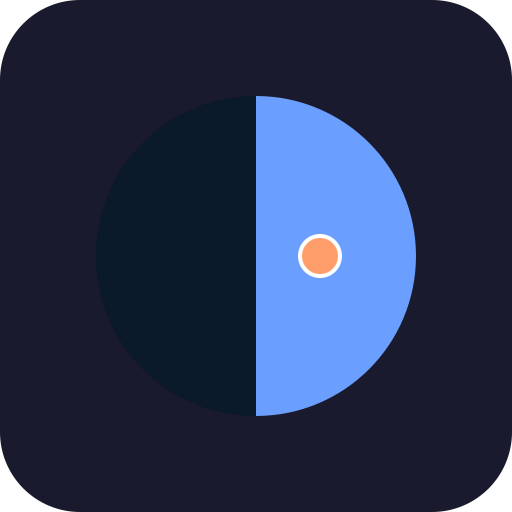

# Contributing to sleepy.help

> Welcome! We're glad you're here. This guide will help you contribute to making sleep better for everyone.

## Table of Contents
1. [Ways to Contribute](#ways-to-contribute)
2. [Getting Started](#getting-started)
3. [Development Workflow](#development-workflow)
4. [Code Guidelines](#code-guidelines)
5. [Submitting Changes](#submitting-changes)
6. [Community](#community)

---

## Ways to Contribute

### 1. Code Contributions
- Implement features from [ROADMAP.md](./ROADMAP.md)
- Fix bugs
- Improve performance
- Add tests
- Refactor for clarity

### 2. Design Contributions
- Improve UI/UX
- Create illustrations
- Design app icons
- Improve accessibility
- Conduct user testing

### 3. Documentation
- Improve existing docs
- Add code comments
- Write tutorials
- Translate to other languages
- Create video guides

### 4. Sleep Science
- Research sleep studies
- Validate our algorithms
- Suggest improvements based on research
- Connect us with sleep researchers

### 5. Testing & Feedback
- Report bugs
- Suggest features
- Test on different devices
- Provide accessibility feedback
- Share user stories

### 6. Community Support
- Answer questions in issues
- Help new contributors
- Share sleepy.help with others
- Write blog posts/reviews

---

## Getting Started

### Prerequisites

**Required:**
- Git
- Web browser (Chrome, Firefox, or Safari)
- Text editor (VS Code, Sublime, Vim, etc.)

**Optional but Helpful:**
- Node.js (for Firebase CLI)
- Python 3 (for local server)

### Setup

1. **Fork the Repository**
   ```bash
   # Via GitHub UI: Click "Fork" button
   ```

2. **Clone Your Fork**
   ```bash
   git clone git@github.com:YOUR-USERNAME/web.git
   cd web
   ```

3. **Add Upstream Remote**
   ```bash
   git remote add upstream git@github.com-sleepy:sleepy-help/web.git
   ```

4. **Start Local Server**
   ```bash
   # Python 3
   python3 -m http.server 8000

   # Python 2
   python -m SimpleHTTPServer 8000

   # Node.js
   npx http-server -p 8000
   ```

5. **Open in Browser**
   ```
   http://localhost:8000
   ```

6. **Make Changes**
   - Edit files in your favorite editor
   - Refresh browser to see changes
   - No build step needed!

---

## Development Workflow

### Finding Something to Work On

1. **Check the Roadmap**
   - See [ROADMAP.md](./ROADMAP.md) for planned features
   - Tasks marked with `[ ]` are available

2. **Browse Issues**
   - Look for `good first issue` label
   - Look for `help wanted` label
   - Ask if you're unsure!

3. **Propose Something New**
   - Open an issue first
   - Discuss the approach
   - Get feedback before coding

### Creating a Branch

```bash
# Sync with upstream
git fetch upstream
git checkout staging
git merge upstream/staging

# Create feature branch
git checkout -b feature/smart-lights

# Or for bug fixes
git checkout -b fix/midnight-calculation
```

**Branch Naming:**
- `feature/description` - New features
- `fix/description` - Bug fixes
- `docs/description` - Documentation
- `refactor/description` - Code refactoring

### Making Changes

1. **Small, Focused Commits**
   ```bash
   # Good: One logical change
   git commit -m "add Hue OAuth flow"

   # Bad: Multiple unrelated changes
   git commit -m "add Hue, fix bug, update docs"
   ```

2. **Commit Message Guidelines**
   - Use present tense ("add feature" not "added feature")
   - Be descriptive but concise
   - Explain *why* not just *what* (in commit body if needed)

3. **Keep Synced**
   ```bash
   # Regularly sync with upstream
   git fetch upstream
   git rebase upstream/staging
   ```

---

## Code Guidelines

### JavaScript Style

**Formatting:**
- 2-space indentation
- Semicolons required
- Single quotes for strings
- Trailing commas in multiline objects/arrays

**Naming:**
```javascript
// Functions: camelCase, descriptive verbs
function calculateBedtime() { ... }
function updateSleepStats() { ... }

// Variables: camelCase, descriptive nouns
const userLocation = { ... }
const sleepCycles = 6

// Constants: UPPER_SNAKE_CASE
const SLEEP_CYCLE_MINUTES = 90
const FALL_ASLEEP_MINUTES = 15
```

**Modern JavaScript:**
```javascript
// ✅ Use const/let (not var)
const wakeTime = '07:00'
let bedtime = null

// ✅ Use arrow functions for short callbacks
setTimeout(() => updateTime(), 1000)

// ✅ Use template literals
console.log(`Bedtime: ${bedtime}`)

// ✅ Use destructuring
const { userLat, userLon } = state
```

**Comments:**
```javascript
// Good: Explain WHY
// Using 90 minutes because that's the average REM cycle duration
const SLEEP_CYCLE_MINUTES = 90

// Bad: Explain obvious WHAT
// Set sleep cycle minutes to 90
const SLEEP_CYCLE_MINUTES = 90

// Good: Complex logic needs explanation
// Rotate so noon appears at top (subtract 12 from hours)
const sunAngle = ((timeDecimal - 12) / 24) * Math.PI * 2
```

### CSS Style

**Organization:**
```css
/* 1. Variables */
:root {
  --color-bg: #0f0f1e;
}

/* 2. Reset/Base */
* { box-sizing: border-box; }

/* 3. Layout */
#app { ... }

/* 4. Components */
.card { ... }

/* 5. Utilities */
.hidden { display: none; }
```

**Naming:**
```css
/* kebab-case for classes and IDs */
.sleep-panel { ... }
#globe-clock { ... }

/* State with data attributes */
.stat[data-status="good"] { ... }
```

**Modern CSS:**
```css
/* ✅ Use CSS variables */
color: var(--color-text);

/* ✅ Use Grid and Flexbox */
display: grid;
gap: var(--space-md);

/* ✅ Use clamp for responsive typography */
font-size: clamp(1rem, 2vw, 1.5rem);
```

### HTML Style

**Semantic HTML:**
```html
<!-- ✅ Good: Semantic tags -->
<header>
  <h1>sleepy.help</h1>
</header>

<main>
  <section>...</section>
</main>

<footer>...</footer>

<!-- ❌ Bad: Div soup -->
<div class="header">
  <div class="title">sleepy.help</div>
</div>
```

**Accessibility:**
```html
<!-- ✅ Proper labels -->
<label for="wake-time">Wake time:</label>
<input type="time" id="wake-time">

<!-- ✅ ARIA when needed -->
<div role="status" aria-live="polite">
  <span id="bedtime-value">21:45</span>
</div>

<!-- ✅ Descriptive alt text -->

```

### File Organization

**Keep related code together:**
```javascript
// ✅ Group by feature
// Globe Clock Component
function drawGlobe() { ... }
function resizeCanvas() { ... }
function animate() { ... }

// Sleep Calculator Component
function calculateBedtime() { ... }
function updateSleepStats() { ... }
```

**Don't spread across files yet:**
- Current: Single `app.js` is fine (500 lines)
- Future: Split at ~1000 lines or when adding major features

---

## Testing

### Manual Testing Checklist

**Before submitting code:**
- [ ] Works in Chrome (latest)
- [ ] Works in Firefox (latest)
- [ ] Works in Safari (latest)
- [ ] Works on mobile (Chrome Android or Safari iOS)
- [ ] Keyboard navigable (tab through all controls)
- [ ] Screen reader friendly (test with VoiceOver or NVDA)
- [ ] Respects reduced motion (System Preferences → Accessibility)
- [ ] Respects dark/light mode (System Preferences → Appearance)
- [ ] Works offline (DevTools → Network → Offline)
- [ ] No console errors

### Test Scenarios

**Globe Clock:**
- [ ] Renders correctly on load
- [ ] Updates every second
- [ ] User marker appears after setting location
- [ ] Resizes properly on window resize

**Sleep Calculator:**
- [ ] Bedtime updates when wake time changes
- [ ] Handles midnight crossing (e.g., wake at 1 AM)
- [ ] Stats update correctly
- [ ] Values persist after page refresh (localStorage)

**PWA:**
- [ ] Service Worker registers successfully
- [ ] Files cached correctly
- [ ] Works offline after first visit
- [ ] Install prompt appears (on supported browsers)

### Future: Automated Tests

**Coming Soon:**
```javascript
// Example: Playwright E2E tests
test('calculate bedtime for 7 AM wake time', async ({ page }) => {
  await page.goto('http://localhost:8000')
  await page.fill('#wake-time', '07:00')
  const bedtime = await page.textContent('#bedtime-value')
  expect(bedtime).toBe('21:45') // 6 cycles @ 90 min + 15 min
})
```

---

## Submitting Changes

### Pull Request Process

1. **Push Your Branch**
   ```bash
   git push origin feature/smart-lights
   ```

2. **Create Pull Request**
   - Go to GitHub
   - Click "New Pull Request"
   - Base: `staging`, Compare: `your-branch`
   - Fill out template (see below)

3. **PR Template**
   ```markdown
   ## Description
   Brief description of what this PR does

   ## Related Issue
   Fixes #123

   ## Changes Made
   - Added Hue OAuth flow
   - Created settings panel for lights
   - Updated documentation

   ## Testing
   - [x] Manual testing completed
   - [x] Browser matrix tested
   - [x] Accessibility reviewed
   - [ ] Automated tests (coming soon)

   ## Screenshots
   (If UI changes)

   ## Checklist
   - [x] Code follows style guidelines
   - [x] Documentation updated
   - [x] No console errors
   - [x] Accessible (keyboard, screen reader)
   ```

4. **Code Review**
   - Maintainers will review
   - Address feedback
   - Update PR with changes

5. **Merge**
   - Once approved, we'll merge
   - Delete your branch after merge

### What Makes a Good PR

**✅ Good PR:**
- Focused on one feature/fix
- Small (~200 lines or less)
- Well-tested
- Documented
- Follows existing patterns

**❌ Challenging PR:**
- Multiple unrelated changes
- Huge (>1000 lines)
- No testing mentioned
- Missing documentation
- Introduces new patterns without discussion

---

## Community

### Communication Channels

**GitHub Issues:**
- Bug reports
- Feature requests
- Technical discussions

**GitHub Discussions (Future):**
- General questions
- Ideas and brainstorming
- Show and tell

**Email:**
- sleepy@help (for private inquiries)

### Code of Conduct

**We are committed to providing a welcoming environment.**

**Expected behavior:**
- Be respectful and kind
- Assume good intentions
- Give constructive feedback
- Focus on the work, not the person

**Unacceptable behavior:**
- Harassment or discrimination
- Trolling or insulting comments
- Personal attacks
- Publishing private information

**Enforcement:**
- Violations will result in warnings or bans
- Report issues to project maintainers

### Recognition

**Contributors are celebrated!**
- Your name in CONTRIBUTORS.md
- Mention in release notes
- Public thank you on social media (with permission)

**Types of contributions recognized:**
- Code
- Design
- Documentation
- Testing
- Community support

---

## Quick Start for Common Tasks

### Add a New UI Element

1. **Add HTML**
   ```html
   <div class="new-feature">
     <h3>Feature Title</h3>
     <button id="feature-btn">Click Me</button>
   </div>
   ```

2. **Style with CSS**
   ```css
   .new-feature {
     padding: var(--space-md);
     background: var(--color-bg-card);
     border-radius: var(--radius);
   }
   ```

3. **Add Interactivity**
   ```javascript
   document.getElementById('feature-btn').addEventListener('click', () => {
     // Your logic here
   })
   ```

4. **Test accessibility**
   - Tab to button
   - Press Enter/Space
   - Test with screen reader

### Fix a Bug

1. **Reproduce the bug**
   - Understand the issue
   - Document steps to reproduce

2. **Locate the code**
   - Use browser DevTools
   - Search codebase
   - Add console.logs

3. **Fix minimally**
   - Change as little as possible
   - Don't refactor while fixing

4. **Verify fix**
   - Test original reproduction steps
   - Check for regressions
   - Test on multiple browsers

5. **Document**
   - Add comment explaining fix
   - Reference issue number

### Add Integration

1. **Read** ARCHITECTURE.md (Integration section)
2. **Create** `integrations/[name].js`
3. **Implement** standard interface:
   ```javascript
   class MyIntegration {
     async connect(credentials) { }
     async disconnect() { }
     async control(params) { }
   }
   ```
4. **Add UI** in settings panel
5. **Document** in README and agent.md
6. **Test** extensively (auth, errors, offline)

---

## Questions?

**Stuck? Need help?**
- Open an issue with `question` label
- We're here to help!
- There are no stupid questions

**Want to discuss an idea?**
- Open an issue first
- Get feedback before investing time
- Collaboration > solo work

**Want to pair program?**
- Reach out! We love teaching
- Especially for `good first issue` tasks

---

## Thank You

**Every contribution matters.**

Whether you:
- Fixed a typo
- Reported a bug
- Added a feature
- Shared with a friend

**You're helping people sleep better. That's meaningful work.**

Welcome to the team. Let's build something beautiful together.

---

*Last updated: 2025-12-07*
*Maintained by: help <sleepy>*
